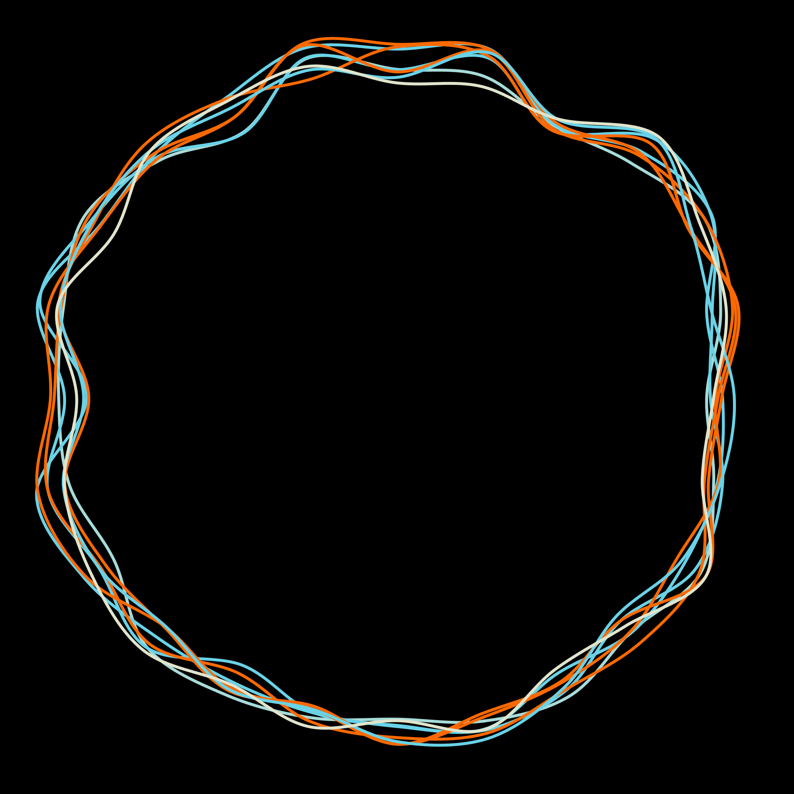

# Generative Art - Drawing Circles

Recently, I've been playing around with some generative music using Propellerhead Reason, mostly for fun. You can find some of it on my SoundCloud:

<iframe width="100%" height="166" scrolling="no" frameborder="no" allow="autoplay" src="https://w.soundcloud.com/player/?url=https%3A//api.soundcloud.com/tracks/1172751727&color=%23ff5500&auto_play=false&hide_related=true&show_comments=false&show_user=true&show_reposts=false&show_teaser=false"></iframe>

_One of my generative music experiments_

## From Music to Visual Art

This exploration into generative music got me thinking about generative **visual** art. After some Googling, I discovered some amazing examples written in R programming language and found good examples in Go and Python too on GitHub.

## Setting Up the Tools

I decided to install R and Processing 3 on my Mac. After trying to get Processing 3 working for a few hours, I wasn't lucky - there were a lot of compatibility problems between Processing 3 and various Java versions.

But Processing v2 worked perfectly, and I got my first images!

At this point, I just wanted to make some pretty art and not dive too deeply into learning the generative algorithms that were already in place.

## The Results

Here are some of the circular patterns I generated:

_Complex overlapping circular patterns_

_Clean, minimalist circles_

_Geometric approach to circular forms_

_More organic, flowing circular design_

_Dense, intricate circular patterns_

_Radiating circular forms_

_Nested circular structures_

_Dynamic, energetic circular composition_

## What I Learned

### The Beauty of Algorithms

Each image represents a different approach to drawing circles:

- **Mathematical precision** vs. **organic randomness**
- **Dense patterns** vs. **minimalist compositions**
- **Overlapping complexity** vs. **clear geometric forms**

### Processing vs. R

- **Processing** felt more intuitive for visual work
- **R** offered powerful mathematical functions
- Both have active communities sharing generative art code

### Creative Coding Philosophy

The most interesting discovery was how **constraints breed creativity**. By limiting myself to circles, I found endless variations:

- Size variations
- Opacity changes
- Color gradients
- Positioning algorithms
- Intersection patterns

## Technical Setup

### What Worked:

- **Processing 2** (avoid v3 for now due to Java issues)
- **Basic geometric functions**
- **Simple randomization**
- **Layer blending modes**

### The Process:

1. Start with basic circle drawing
2. Add randomization to position/size
3. Experiment with colors and opacity
4. Layer multiple generations
5. Apply blending modes for interesting intersections

## Future Directions

This was just the beginning! Next I want to explore:

- **Animation** - making these patterns move
- **Interactive elements** - user input affecting generation
- **3D forms** - extending circles into spheres
- **Integration with music** - visual response to audio

## The Joy of Generative Art

What I love about generative art is the **surprise factor**. You write the rules, but the computer creates something you never could have planned exactly. It's a collaboration between your creative vision and computational possibility.

Each image is both **planned and accidental**, **controlled and chaotic**.

## Getting Started Yourself

If you want to try generative art:

1. **Start simple** - download Processing and try basic shapes
2. **Copy and modify** - find examples online and tweak them
3. **Embrace happy accidents** - the best results are often unexpected
4. **Share your work** - the community is incredibly supportive

The barrier to entry is lower than you think. You don't need to be a mathematician or expert programmer - just curious and willing to experiment!

---

_Have you tried generative art? What tools or languages have you experimented with? I'd love to see what you create!_
