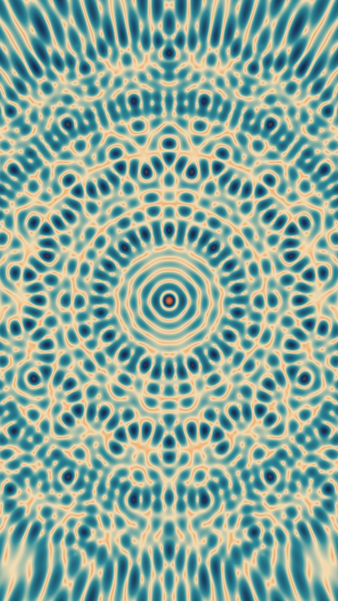
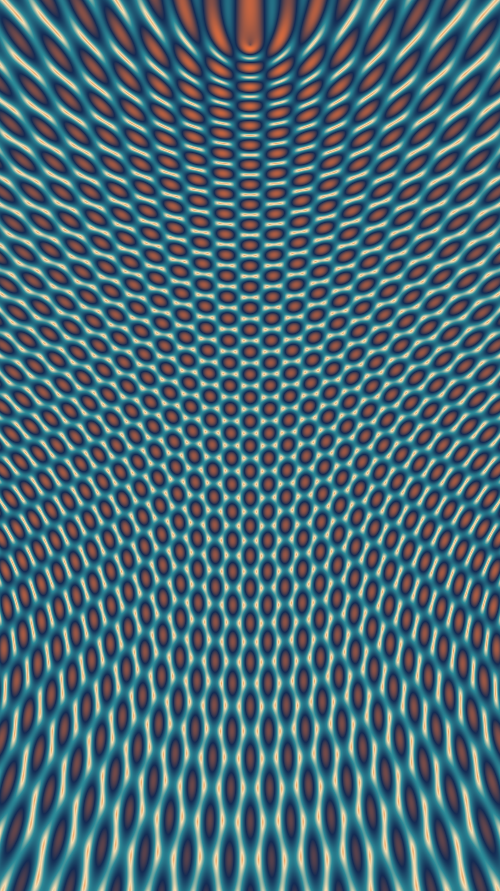

# Generative Waves

After exploring circular patterns in my previous generative art experiments, I wanted to dive into something more fluid and organic. That's when I discovered [Wavepaper](https://github.com/DeanIsMe/Wavepaper_Release) - a tool for creating beautiful wave-like generative patterns.

## The Wave Collection

Here are some of the wave patterns I generated:

_Smooth, flowing waves with subtle gradients_

_Complex intersecting wave patterns_

_Minimal, clean wave composition_

_Dynamic wave motion with varying amplitudes_

_Multiple layered wave structures_

_Organic, natural-looking wave flow_

_More geometric approach to wave generation_

_Complex wave interference patterns_

## From Circles to Waves

### Why Waves?

After working with circular patterns, waves felt like a natural progression. Where circles are contained and finite, waves are:

- **Continuous and flowing**
- **Rhythmic and musical**
- **Organic and natural**
- **Mathematically elegant**

### The Mathematics of Beauty

Waves showcase some of the most beautiful mathematical concepts:

- **Sine and cosine functions** creating smooth oscillations
- **Frequency variations** producing different rhythms
- **Amplitude changes** controlling intensity
- **Phase shifts** creating interference patterns

## Technical Approach

### Wavepaper Tool

[Wavepaper](https://github.com/DeanIsMe/Wavepaper_Release) made the technical barrier much lower than coding from scratch. It allowed me to:

- Focus on **aesthetic decisions** rather than mathematical implementation
- **Rapidly iterate** through different parameters
- **Export high-quality** results
- **Experiment freely** without programming knowledge

### Parameter Exploration

Each image represents different parameter combinations:

- **Wave frequency** - how tight or loose the waves are
- **Amplitude** - the height/intensity of the waves
- **Color gradients** - the visual flow through the spectrum
- **Layering** - multiple wave systems interacting

## Aesthetic Discoveries

### Pattern Recognition

Working with waves revealed interesting patterns:

- **Simple parameters** often produce the most elegant results
- **Slight variations** can create dramatically different moods
- **Color choice** is as important as the wave mathematics
- **Negative space** plays a crucial role in composition

### Emotional Response

Different wave patterns evoke different feelings:

- **Gentle curves** feel calming and meditative
- **Sharp frequencies** create energy and tension
- **Layered patterns** suggest complexity and depth
- **Minimal compositions** feel clean and modern

## Creative Process

### My Workflow:

1. **Start with defaults** - see what the tool produces naturally
2. **Adjust one parameter** at a time to understand its effect
3. **Save interesting variations** as I discover them
4. **Experiment with color** to enhance the mood
5. **Export multiple versions** for comparison

### Happy Accidents

Some of my favorite results came from:

- **Accidental parameter combinations**
- **Pushing settings to extremes**
- **Unexpected color interactions**
- **System glitches** that created unique patterns

## Waves in Context

### Music Connection

Having worked with generative music, waves feel like a natural visual counterpart:

- Both use **mathematical functions** as building blocks
- Both create **patterns that feel organic** despite being algorithmic
- Both can be **simple or complex** depending on parameters
- Both have **rhythm and flow**

### Nature Inspiration

Waves appear everywhere in nature:

- **Ocean waves** - the obvious inspiration
- **Sound waves** - invisible but fundamental
- **Light waves** - creating all the colors we see
- **Brain waves** - the patterns of thought itself

## Technical Notes

### Tool Advantages:

- **User-friendly interface** for non-programmers
- **Real-time preview** of parameter changes
- **High-quality export** options
- **Stable performance** on Mac

### Limitations:

- **Less control** than coding from scratch
- **Preset algorithms** limit some creative possibilities
- **Black box approach** - harder to understand the mathematics

## Future Explorations

This wave exploration opens up several directions:

- **Animation** - making waves move and evolve over time
- **Interactive waves** - responding to user input or music
- **3D wave surfaces** - extending into three dimensions
- **Combining with circles** - hybrid geometric/organic forms

## Personal Reflection

Working with generative waves has been meditative. There's something about the flow and rhythm that connects with a deeper sense of natural patterns. Unlike the precision of circles, waves feel more alive and breathing.

The process taught me that **algorithmic art isn't about replacing human creativity** - it's about **partnering with mathematical beauty** to discover forms we couldn't imagine on our own.

---

_What patterns in nature inspire your creative work? Have you experimented with wave-based generative art? I'd love to see your explorations!_
