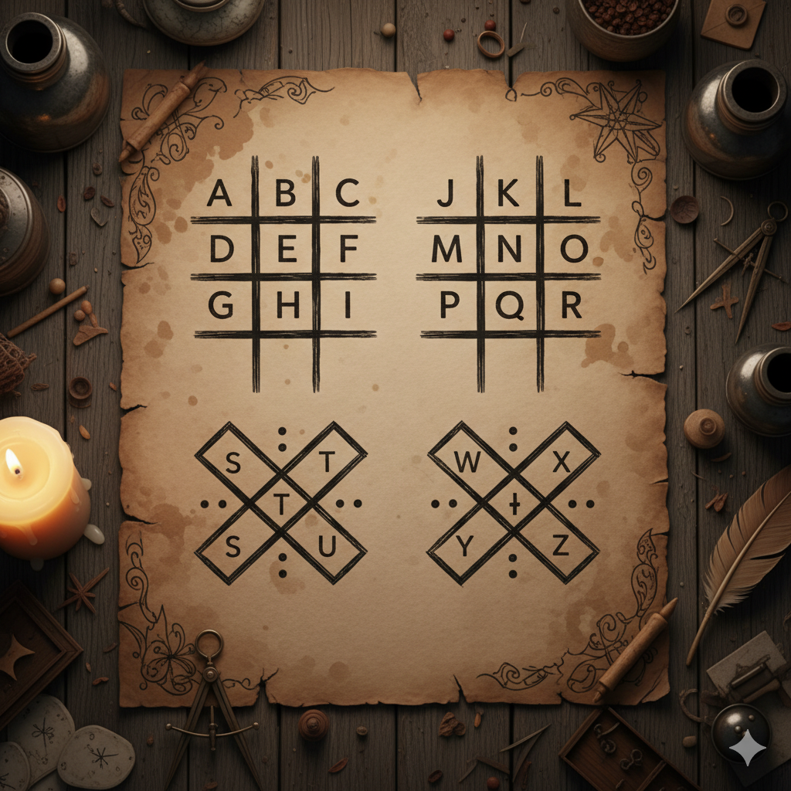

# Getting Started with React Native

I have been working with React in past years and know my way around it. I have heard about React Native but never had any client or idea to build something with it until I saw a Reddit post about pigpen cipher. As soon as I saw the post I got an idea to turn it into an app so I can send a semi-encrypted message to anyone.


_The traditional Pigpen cipher key - each letter gets its own symbol_

## Discovering Expo

So I started Googling React Native and was introduced to [Expo.io](https://expo.io/).

Expo helps you set up and develop a project with zero configuration. Expo comes with an app for iOS and Android so you can see your app on a native device with native code. Let's install Expo first:

```bash
npm install -g expo-cli
expo init Pigpen-cipher
```

With Expo's basic tab example, I already had a working app with tabs. The idea was to have two different tabs for encrypting and decrypting messages.

After a couple of hours, I was done and could see my app in the browser by running:

```bash
expo start --web
```

Everything worked great and I saved all my cipher symbols as SVG files in the app.

## The SVG Challenge

But when I started looking at the app in the native iOS environment I could see that my SVGs were not showing up. After googling for hours and trying different libraries I got back to the original `react-native-svg` and converted my SVGs to React components. But still no luck!

After looking around and playing with the code for about an hour I found the problem: **I forgot to set the width & height for each SVG component.**

<iframe allowfullscreen="" class="giphy-embed" frameborder="0" height="300" src="https://giphy.com/embed/6xcqPF9MTwChq" width="300" style="margin: 20px auto; display: block;"></iframe>

_The moment when you finally figure out the bug! 🎉_

## Success!

After that everything worked as it should. You can click on the symbols to decrypt a message or write your text and encrypt it.

The next step would be to make it so you can save your encrypted message as an image so you can send it to your friends.

## What's Next?

Before implementing the save feature, it was time for "git push". You can see and download the app on [my GitHub](https://github.com/ehsanpo/Pigpen-cipher).

Next, I planned to use:

- [react-native-view-shot](https://github.com/gre/react-native-view-shot) - to convert the SVG React component to an image
- [react-native-cameraroll](https://github.com/react-native-community/react-native-cameraroll) - to save it to the camera roll

## Key Learnings

### What I Learned:

1. **Expo is amazing** for getting started quickly with React Native
2. **SVG handling** in React Native requires explicit width/height properties
3. **Cross-platform development** has its quirks - always test on actual devices
4. **Problem-solving persistence** pays off - sometimes the solution is simpler than you think

### Tips for React Native Beginners:

- Start with Expo for rapid prototyping
- Always test on both web and native platforms
- When using SVGs, remember to set dimensions explicitly
- Don't be afraid to dive into GitHub issues when stuck

The Pigpen cipher app was a great introduction to React Native development, and it showed me how quickly you can go from idea to working mobile app with the right tools!

---

_Want to try the Pigpen cipher for yourself? Check out the [GitHub repository](https://github.com/ehsanpo/Pigpen-cipher) and give it a star if you find it useful!_
