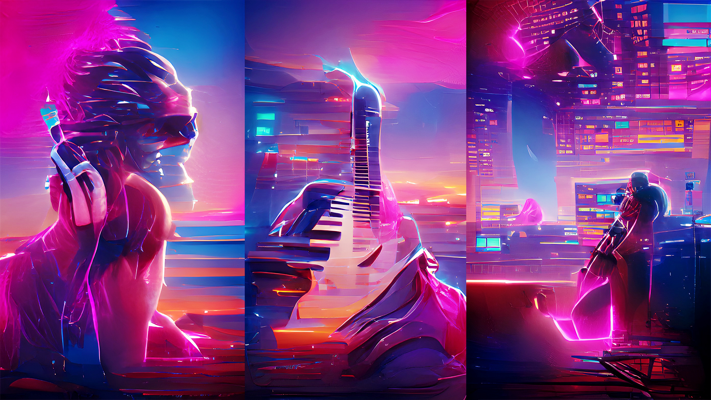

# Music Production Tools in 2022

Recently I've been using some AI to help me in music production! Not so much in generating the music itself, but some tools that are handy for every producer.

Let's say you want to make a remix of an old song - here's my complete workflow with all the modern tools that make it possible:

## 🎵 The Complete Music Production Workflow

### 1. Get Your Software

- Get your DAW or VST plugins at [Professional Audio Software Blog](https://audioz.download/)

_Note: I always recommend supporting developers by purchasing legitimate software when possible!_

### 2. Find the Chords

- **[Chordify](https://chordify.net/)** - Instant chords for any song

This tool analyzes any song and gives you the chord progressions. It's incredibly accurate and saves hours of ear training!

### 3. Extract the Vocals

- **[Acapella-extractor.com](http://acapella-extractor.com/)** - Free vocal extraction
- **[LALAL.AI](https://www.lalal.ai/)** - Premium AI-powered stem separation

These tools use machine learning to separate vocals, drums, bass, and other instruments from mixed tracks. Perfect for remixing!

### 4. Master Your Track

- **[Bakuage](https://bakuage.com/en/)** - AI audio mastering service
- **[LANDR](https://www.landr.com/)** - Creative tools for musicians with AI mastering

No more guessing with EQ and compression settings. These AI mastering services analyze your track and apply professional-grade processing.

### 5. Create Visuals

- **[Butterchurn Visualizer](https://butterchurnviz.com/)** - Stunning audio-reactive visuals
- **[Kaleidosync](https://www.kaleidosync.com/visualizer)** - Spotify-connected visualizer

Visual content is crucial for social media. These tools create mesmerizing visuals that sync perfectly with your music.

### 6. Generate Cover Art

- **[WOMBO Dream](https://app.wombo.art/)** - AI-created art

Type in a description like "synthwave sunset city" and get unique cover art in seconds. The results are surprisingly good!

### 7. Promote Your Music

- **[HQlikes SMM Panel](https://hqlikes.com/referral/id/7546702)** - Social media marketing

_Note: Focus on organic growth and genuine engagement first!_

## 🤖 Why AI Tools Are Game-Changers

### Speed vs. Quality

These tools don't replace creativity - they remove tedious technical barriers so you can focus on the creative parts.

### Accessibility

Previously, you needed expensive studio time and years of training to achieve professional results. Now, bedroom producers have access to the same tools as major labels.

### Learning Opportunities

Using these tools also teaches you about production techniques. When LALAL.AI separates stems, you can study how professional tracks are arranged.

## 🎛️ My Actual Workflow

Here's how I actually use these tools in practice:

1. **Find inspiration** - Browse Spotify for songs to remix
2. **Extract elements** - Use LALAL.AI to get clean vocals
3. **Analyze structure** - Chordify shows me the harmonic foundation
4. **Produce** - Build my remix in my DAW
5. **Master** - Quick master with Bakuage for demos
6. **Visualize** - Create a video with Butterchurn
7. **Package** - Generate cover art with WOMBO
8. **Release** - Upload to SoundCloud/Spotify

## ⚠️ Important Notes

### Legal Considerations

- Always clear samples and vocals legally
- Respect copyright laws
- Give credit where due

### Creative Balance

- Use AI as a starting point, not the final product
- Develop your own style and ear
- Don't let tools replace musical knowledge

### Quality Control

- AI tools aren't perfect - always review results
- Learn the fundamentals so you can fix AI mistakes
- Trust your ears over algorithms

## 🔮 The Future

The pace of innovation in music AI is incredible. We're seeing:

- Real-time collaboration with AI musicians
- Style transfer that sounds increasingly natural
- Automated mixing that rivals human engineers

But remember: **technology should serve creativity, not replace it.**

## My Take

These tools have genuinely revolutionized my workflow. What used to take days now takes hours. But the most important ingredient is still your creativity and musical taste.

The democratization of music production tools means anyone can make professional-sounding music. The challenge now isn't technical - it's standing out in an ocean of content.

---

_What tools are you using in your music production workflow? Have you tried any AI-powered solutions? Let me know your experiences in the comments!_
